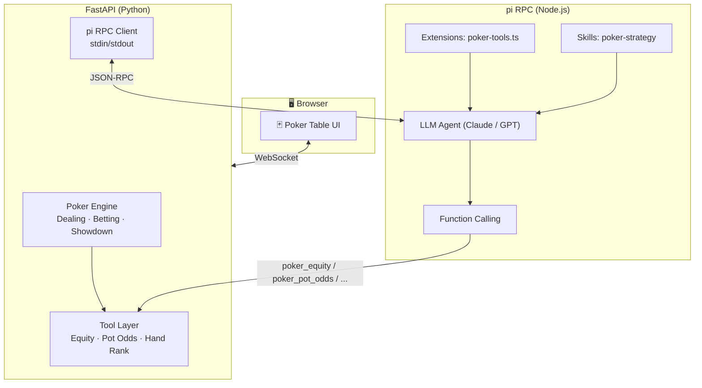

# 🃏 TexasAgent

LLM-powered Texas Hold'em poker AI agent. Uses [pi coding agent](https://github.com/badlogic/pi-coding-agent) for LLM reasoning and tool calling, backed by a deterministic poker engine and a FastAPI web UI.

[](LICENSE)
[](https://www.python.org/)
[](https://docs.astral.sh/uv/)
[](https://github.com/casey/just)

> [中文](README.zh-CN.md)

## How It Works



The LLM acts as the "brain" — strategizing, reading opponents, and deciding when to bluff. The tools provide precise mathematical backing (equity, pot odds, GTO frequencies). pi provides the agent infrastructure: tool registration, turn management, conversation history, and RPC communication.

## Quick Start

### Prerequisites

- **Python 3.11+** and **[uv](https://docs.astral.sh/uv/)** for the Python side
- **[just](https://github.com/casey/just)** for command shortcuts
- **[pi](https://github.com/badlogic/pi-coding-agent)** for the LLM agent runtime
- **[TexasSolver](https://github.com/bupticybee/TexasSolver)** (optional) for GTO solving

### Install & Run

```bash
# Clone
git clone https://github.com/001eander/TexasAgent.git
cd TexasAgent

# Install Python dependencies
just install

# Start the server
just dev
```

Open **http://localhost:8000** — configure your table and start playing.

### Install pi package

```bash
# Install the poker tools for use with pi
pi install ./pi-package

# Test it interactively
just pi-dev
```

## Development

```bash
just            # List all commands
just dev        # Start FastAPI with hot reload
just test       # Run all tests
just test-cov   # Tests with coverage
just fmt        # Format code (ruff)
just lint       # Lint code (ruff)
just typecheck  # Type check (mypy)
just check      # All quality checks
just clean      # Remove generated files
```

Git hooks (lefthook) run format, lint, and typecheck on commit, plus full test suite on push.

## Project Structure

```
texas-agent/
├── app/
│   ├── main.py                  # FastAPI app + WebSocket + REST API
│   ├── engine/
│   │   ├── types.py             # Core domain types (Card, GameState, etc.)
│   │   ├── deck.py              # 52-card deck with deterministic shuffle
│   │   ├── hand.py              # 7-card best-5 hand evaluator
│   │   └── game.py              # NLHE state machine (deal, bet, showdown)
│   ├── tools/
│   │   └── equity.py            # Monte Carlo equity + pot odds + hand strength
│   ├── agent/
│   │   └── pi_client.py         # pi RPC subprocess client
│   ├── db/                      # Database models (SQLite)
│   └── templates/
│       ├── index.html           # Landing page + table setup
│       └── table.html           # Interactive poker table UI
├── pi-package/                  # pi coding agent package
│   ├── package.json
│   ├── extensions/
│   │   └── poker-tools.ts       # 6 poker tools registered for LLM
│   ├── skills/
│   │   └── poker-strategy/
│   │       └── SKILL.md         # GTO strategy reference
│   └── scripts/
│       ├── equity.py            # CLI equity calculator
│       └── hand_strength.py     # CLI hand strength evaluator
├── tests/
│   ├── test_engine/             # 43 poker engine tests
│   └── test_tools.py            # 11 tool layer tests
├── pyproject.toml               # Python project config (uv)
├── justfile                     # Command shortcuts
├── lefthook.yml                 # Git hooks
└── .prd-body.md                 # PRD (also GitHub issue #1)
```

## Poker Engine

A deterministic, testable state machine for No-Limit Texas Hold'em:

- **Dealing:** 2 hole cards per player, 5 community cards (flop/turn/river)
- **Betting:** fold, check, call, bet, raise, all-in with correct min-raise logic
- **Side pots:** proper handling of all-in scenarios with multiple side pots
- **Showdown:** 7-card best-5 evaluation comparing all hand ranks
- **Seedable RNG:** deterministic deck for reproducible testing

```python
from app.engine.game import create_game, start_hand, apply_action, legal_actions, showdown
from app.engine.types import Action, ActionType

state = create_game(num_players=6, seed=42)
state = start_hand(state, seed=42)

actions = legal_actions(state)  # → [FOLD, CALL 2, RAISE 4, ALL-IN 1000]
state = apply_action(state, actions[2])  # raise to 4
```

## pi Tools

Six tools registered for the LLM agent to call during decision-making:

| Tool | What it does |
|------|-------------|
| `poker_equity` | Monte Carlo simulation — win/tie/lose probabilities |
| `poker_hand_strength` | Evaluates current made hand (pair, straight, flush…) |
| `poker_pot_odds` | Pot odds ratio + minimum equity required to call |
| `poker_opponent_stats` | VPIP, PFR, 3-bet%, aggression factor per opponent |
| `poker_range_analysis` | Range description vs board texture analysis |
| `poker_solve` | GTO solver bridge (requires TexasSolver installed) |

The `poker-strategy` skill provides GTO fundamentals, position-based ranges, bet sizing theory, and exploitation heuristics — loaded into the LLM's context on demand.

## Testing

```bash
just test       # 54 tests, all passing
just test-cov   # with coverage report
```

Tests follow the seams defined in the [PRD](https://github.com/001eander/TexasAgent/issues/1):

- **Seam 2 — Poker Engine:** 43 tests. Deterministic state machine, hand evaluation, game flow.
- **Seam 3 — Tool Layer:** 11 tests. Monte Carlo equity, pot odds, hand strength.

## Configuration

### Switch LLM provider

```bash
# Use a different model for pi
just pi-dev model=openai/gpt-4o

# Or in the pi RPC server
just pi-rpc model=anthropic/claude-haiku-3-5-sonnet
```

### Enable GTO Solver

```bash
# Install TexasSolver
git clone https://github.com/bupticybee/TexasSolver.git
cd TexasSolver && mkdir build && cd build && cmake .. && make

# Set path
export TEXAS_SOLVER_PATH=/path/to/TexasSolver/build/console_solver
```

### Agent difficulty

Adjust the system prompt in `pi-package/skills/poker-strategy/SKILL.md` or set thinking level:

```bash
pi --mode rpc -e pi-package/extensions/poker-tools.ts --thinking-level high
```

## Roadmap

- [x] Poker engine with full NLHE rules
- [x] Hand evaluator (7-card best-5)
- [x] Monte Carlo equity calculator
- [x] pi package with 6 poker tools
- [x] FastAPI server + WebSocket
- [x] Interactive web UI
- [ ] pi RPC integration for LLM-powered agents
- [ ] SQLite opponent tracking database
- [ ] Hand history replay and analysis
- [ ] TexasSolver GTO integration
- [ ] Session statistics (BB/100, profit charts)
- [ ] Multi-table support

## License

MIT
