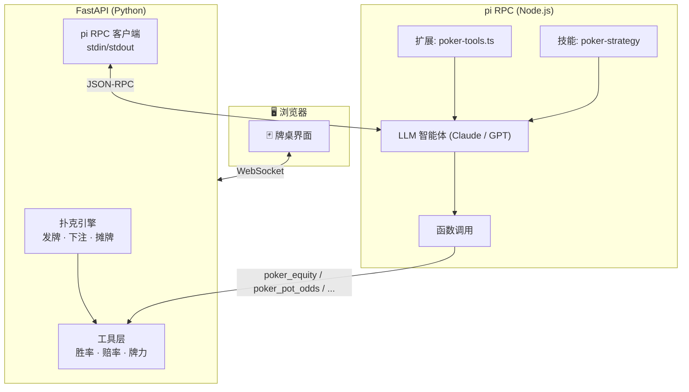

# 🃏 TexasAgent

LLM 驱动的德州扑克 AI 智能体。使用 [pi coding agent](https://github.com/badlogic/pi-coding-agent) 作为 LLM 推理和工具调用的运行时，配合确定性扑克引擎和 FastAPI Web 界面。

[](LICENSE)
[](https://www.python.org/)
[](https://docs.astral.sh/uv/)
[](https://github.com/casey/just)

> [English](README.md)

## 工作原理



LLM 作为"大脑"——制定策略、阅读对手、决定何时诈唬。工具层提供精确的数学支持（胜率、赔率、GTO 频率）。pi 提供智能体基础设施：工具注册、回合管理、对话历史和 RPC 通信。

## 快速开始

### 环境要求

- **Python 3.11+** 和 **[uv](https://docs.astral.sh/uv/)** — Python 侧依赖管理
- **[just](https://github.com/casey/just)** — 命令快捷方式
- **[pi](https://github.com/badlogic/pi-coding-agent)** — LLM 智能体运行时
- **[TexasSolver](https://github.com/bupticybee/TexasSolver)**（可选）— GTO 求解

### 安装与运行

```bash
# 克隆仓库
git clone https://github.com/001eander/TexasAgent.git
cd TexasAgent

# 安装依赖
just install

# 启动服务
just dev
```

打开 **http://localhost:8000** — 配置牌桌后即可开始游戏。

### 安装 pi 包

```bash
# 安装扑克工具到 pi
pi install ./pi-package

# 交互式测试
just pi-dev
```

## 开发指南

```bash
just            # 列出所有命令
just dev        # 启动 FastAPI（热重载）
just test       # 运行全部测试
just test-cov   # 带覆盖率报告
just fmt        # 格式化代码 (ruff)
just lint       # 代码检查 (ruff)
just typecheck  # 类型检查 (mypy)
just check      # 全部质量检查
just clean      # 清理生成文件
```

Git hooks (lefthook) 在提交时运行格式化和检查，推送时运行完整测试。

## 项目结构

```
texas-agent/
├── app/
│   ├── main.py                  # FastAPI 应用 + WebSocket + REST API
│   ├── engine/
│   │   ├── types.py             # 核心领域类型（Card, GameState 等）
│   │   ├── deck.py              # 52 张牌组，支持确定性洗牌
│   │   ├── hand.py              # 7选5 最佳手牌评估器
│   │   └── game.py              # NLHE 状态机（发牌、下注、摊牌）
│   ├── tools/
│   │   └── equity.py            # 蒙特卡洛胜率 + 底池赔率 + 牌力评估
│   ├── agent/
│   │   └── pi_client.py         # pi RPC 子进程客户端
│   ├── db/                      # 数据库模型 (SQLite)
│   └── templates/
│       ├── index.html           # 首页 + 牌桌设置
│       └── table.html           # 交互式牌桌界面
├── pi-package/                  # pi 编码智能体包
│   ├── package.json
│   ├── extensions/
│   │   └── poker-tools.ts       # 注册 6 个扑克工具供 LLM 调用
│   ├── skills/
│   │   └── poker-strategy/
│   │       └── SKILL.md         # GTO 策略参考
│   └── scripts/
│       ├── equity.py            # CLI 胜率计算器
│       └── hand_strength.py     # CLI 牌力评估器
├── tests/
│   ├── test_engine/             # 43 个扑克引擎测试
│   └── test_tools.py            # 11 个工具层测试
├── pyproject.toml               # Python 项目配置 (uv)
├── justfile                     # 命令快捷方式
├── lefthook.yml                 # Git hooks
└── .prd-body.md                 # PRD（也是 GitHub issue #1）
```

## 扑克引擎

确定性、可测试的无限制德州扑克状态机：

- **发牌：** 每位玩家 2 张底牌，5 张公共牌（翻牌/转牌/河牌）
- **下注：** 弃牌、过牌、跟注、下注、加注、全下，含正确的最小加注逻辑
- **边池：** 正确处理全下场最的多人边池
- **摊牌：** 7选5 最佳手牌比较，涵盖所有牌型
- **可复现随机：** 通过种子控制洗牌，测试可复现

```python
from app.engine.game import create_game, start_hand, apply_action, legal_actions, showdown
from app.engine.types import Action, ActionType

state = create_game(num_players=6, seed=42)
state = start_hand(state, seed=42)

actions = legal_actions(state)  # → [弃牌, 跟注 2, 加注 4, 全下 1000]
state = apply_action(state, actions[2])  # 加注到 4
```

## pi 工具

LLM 智能体在决策时可调用六个工具：

| 工具 | 功能 |
|------|------|
| `poker_equity` | 蒙特卡洛模拟 — 胜/平/负概率 |
| `poker_hand_strength` | 评估当前成手牌（一对、顺子、同花……） |
| `poker_pot_odds` | 底池赔率 + 跟注所需最低胜率 |
| `poker_opponent_stats` | 每位对手的 VPIP、PFR、3-bet%、激进因子 |
| `poker_range_analysis` | 范围描述 vs 牌面结构分析 |
| `poker_solve` | GTO 求解器桥接（需安装 TexasSolver） |

`poker-strategy` 技能提供 GTO 基础理论、位置范围、下注尺度理论和剥削策略——按需加载到 LLM 上下文中。

## 测试

```bash
just test       # 54 个测试，全部通过
just test-cov   # 带覆盖率报告
```

测试按照 [PRD](https://github.com/001eander/TexasAgent/issues/1) 中定义的接缝组织：

- **接缝 2 — 扑克引擎：** 43 个测试。确定性状态机、手牌评估、游戏流程。
- **接缝 3 — 工具层：** 11 个测试。蒙特卡洛胜率、底池赔率、牌力评估。

## 配置

### 切换 LLM 提供商

```bash
# 为 pi 使用不同模型
just pi-dev model=openai/gpt-4o

# 或在 pi RPC 服务中指定
just pi-rpc model=anthropic/claude-haiku-3-5-sonnet
```

### 启用 GTO 求解器

```bash
# 安装 TexasSolver
git clone https://github.com/bupticybee/TexasSolver.git
cd TexasSolver && mkdir build && cd build && cmake .. && make

# 设置路径
export TEXAS_SOLVER_PATH=/path/to/TexasSolver/build/console_solver
```

### 调整 AI 难度

修改 `pi-package/skills/poker-strategy/SKILL.md` 中的系统提示词，或设置思考级别：

```bash
pi --mode rpc -e pi-package/extensions/poker-tools.ts --thinking-level high
```

## 路线图

- [x] 完整 NLHE 规则的扑克引擎
- [x] 手牌评估器（7选5）
- [x] 蒙特卡洛胜率计算器
- [x] 含 6 个扑克工具的 pi 包
- [x] FastAPI 服务 + WebSocket
- [x] 交互式 Web 界面
- [ ] pi RPC 集成 LLM 智能体
- [ ] SQLite 对手追踪数据库
- [ ] 手牌历史回放与分析
- [ ] TexasSolver GTO 集成
- [ ] 会话统计（BB/100、盈利图表）
- [ ] 多桌支持

## 许可

MIT
